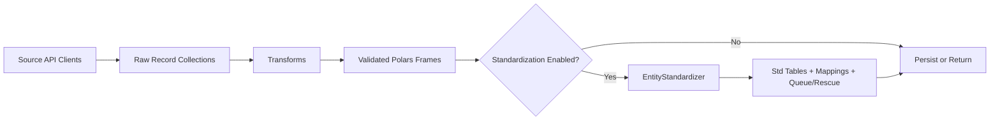

# Zensical Package Documentation

A calm, practical map of the package: what it does, how modules fit together, and how to run each pipeline with confidence.

## 1. What This Package Is

This repository provides one Python package namespace, `nfl`, with four production-oriented data libraries:

- `nfl.yahoo_fantasy`: Yahoo Fantasy ingestion and normalization.
- `nfl.fantasypros_fantasy`: FantasyPros player and ADP ingestion.
- `nfl.nflverse_fantasy`: nflverse ingestion for broad NFL datasets.
- `nfl.entity_standardization`: cross-source entity matching and canonicalization.

The architecture is library-first: import and run from Python code, tests, or notebooks.

## 2. Core Design Principles

- Deterministic transforms: raw records become contract-shaped Polars DataFrames.
- Optional persistence: write nowhere, to Polars files, to Iceberg tables, or both.
- Idempotency-aware storage: write logs protect against accidental duplicate writes.
- Composable standardization: source pipelines can attach canonicalization when needed.
- Contract validation at boundaries: schemas are validated where data enters or exits.

## 3. Package Topology

```text
src/nfl/
  yahoo_fantasy/
    api.py, auth.py, pipeline.py, transforms.py, validation.py, views.py
  fantasypros_fantasy/
    api.py, matching.py, pipeline.py, transforms.py, validation.py
    storage/iceberg.py, storage/polars.py
  nflverse_fantasy/
    api.py, pipeline.py, transforms.py, validation.py
    storage/iceberg.py, storage/polars.py
  entity_standardization/
    canonical.py, matching.py, normalize.py, overrides.py
    pipeline.py, storage.py, validation.py
```

## 4. Public API Surface

### 4.1 Yahoo Fantasy

Primary imports:

- `build_oauth_session`
- `PipelineConfig`
- `PipelineRunResult`
- `run_pipeline`
- `YahooApiClient`

Pipeline entry point:

- `run_pipeline(league_key, sport, oauth_session=None, config=None, api_client=None)`

Notes:

- Requires `oauth_session` unless a custom `api_client` is supplied.
- Supports `sport` values: `nfl`, `nba`.
- Optional materialized views are available through config flags.

### 4.2 FantasyPros Fantasy

Primary imports:

- `PipelineConfig`
- `PipelineRunResult`
- `run_pipeline`
- `FantasyProsApiClient`

Pipeline entry point:

- `run_pipeline(season, sport="nfl", config=None, api_client=None, yahoo_players=None)`

Notes:

- Produces an additional materialized table, `nfl_fp_current_adp`.
- If `yahoo_players` are supplied, crosswalk records are generated.

### 4.3 NFLverse Fantasy

Primary imports:

- `PipelineConfig`
- `PipelineRunResult`
- `run_pipeline`
- `NflverseApiClient`

Pipeline entry point:

- `run_pipeline(config=None, api_client=None)`

Notes:

- `enabled_entities` can narrow ingestion scope for speed and focus.
- Designed for wide ingestion, then optional persistence and standardization.

### 4.4 Entity Standardization

Primary imports:

- `EntityStandardizer`
- `StandardizationConfig`
- `StandardizationResult`
- `CanonicalRegistry`
- `CanonicalRegistryLoader`

Pipeline entry point:

- `EntityStandardizer(...).standardize_batch(records)`

Notes:

- Supports threshold-driven auto-accept plus manual-override resolution.
- Generates operational tables for queueing, rescue, and source-to-canonical maps.

## 5. Configuration Cheat Sheet

### 5.1 Shared Pipeline Pattern

Most pipelines expose this pattern:

- `storage_target`: `none`, `polars`, `iceberg`, or `both`.
- `polars_output_dir`: output folder for local files.
- `polars_file_format`: commonly `parquet`.
- `iceberg_dry_run`: safe test mode for write planning.
- `iceberg_idempotency_store`: write-log path.
- `standardization_enabled`: toggles entity standardization integration.
- `standardization_config`: optional override for default standardization behavior.

### 5.2 Standardization Defaults

`StandardizationConfig` defaults to strict matching thresholds:

- player: `0.97`
- team: `0.995`
- position: `1.0`

Persistence in standardization is off by default:

- `persist_tables=False`
- `iceberg_enabled=False`

## 6. Data Flow (Mental Model)



## 7. Operational Tables From Standardization

When standardization runs, you can expect these tables:

- `std_standardized_outputs`: normalized record-level outcomes.
- `std_source_to_canonical_map`: source ID to canonical player mapping.
- `std_match_queue`: unresolved or low-confidence rows for review.
- `std_match_queue_open`: active review queue (`new`, `in_review`).
- `std_match_queue_history`: resolved review history.
- `std_rescued_records`: unresolved payloads staged for replay.
- `std_manual_overrides`: human-approved corrections.
- `std_canonical_players`, `std_canonical_teams`, `std_canonical_positions`: canonical reference dimensions.

## 8. Typical Usage Profiles

- Local exploration: `storage_target="polars"`, `iceberg_dry_run=True`.
- Integration testing: `storage_target="none"` to validate transforms only.
- Production-like rehearsal: `storage_target="both"`, keep `iceberg_dry_run=True` until confidence is high.
- Full persistence: `storage_target="both"` and `iceberg_dry_run=False` in controlled environments.

## 9. Validation and Testing

Primary test suite location:

- `tests/`

Run tests (from repository root):

```powershell
C:/Users/EricTruett/miniconda3/envs/dbxconnect/python.exe -m pytest -q
```

The suite includes module-level coverage for API clients, transforms, storage adapters, validation contracts, and pipelines.

## 10. Blueprints and Deeper Context

Design and migration references:

- `blueprints/YAHOO_INTEGRATION_BLUEPRINT.md`
- `blueprints/FANTASY_PROS_INTEGRATION_BLUEPRINT.md`
- `blueprints/FANTASY_PROS_NOTEBOOK_MIGRATION.md`
- `blueprints/NFLVERSE_INGESTION_BLUEPRINT.md`
- `blueprints/ENTITY_STANDARDIZATION_BLUEPRINT.md`

Use this zensical guide as your orientation layer, then open blueprint docs when you need deep implementation or milestone-level detail.
